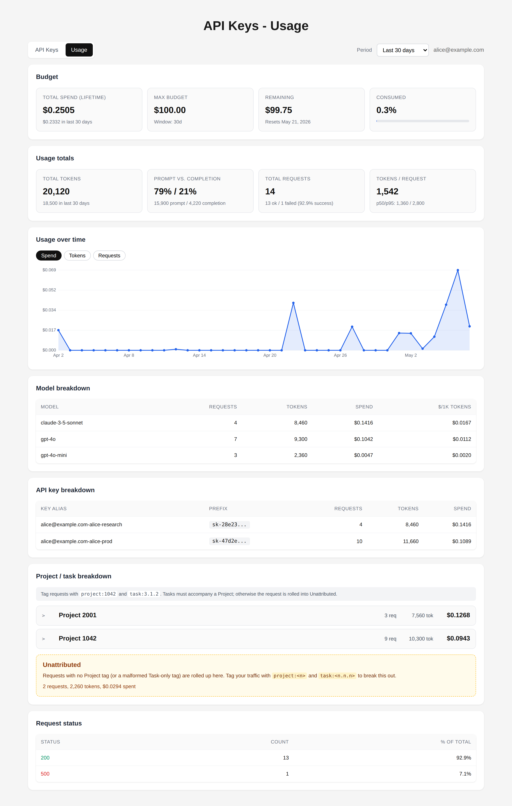
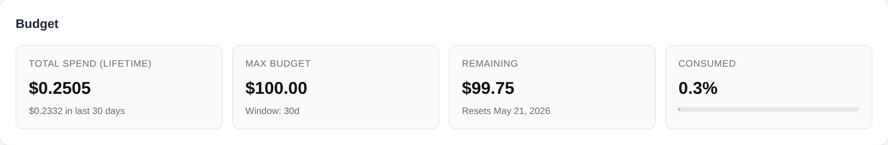
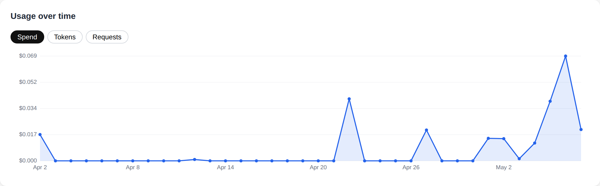

# Usage Dashboard

_Date: 2026-05-07_

The Usage page surfaces a user's LiteLLM accounting data — spend, token
volume, request rate, and budget posture — in a single view. It pulls from
the proxy on demand (no separate database) and aggregates everything
server-side so the browser only renders, never recomputes.



## What it shows

### Budget posture

Pulled from `GET /user/info`. Shows lifetime spend, the configured
`max_budget`, the remaining headroom, and the percentage consumed of the
current budget window. The progress bar shifts colour as the user
crosses the soft budget threshold and again when they cross 90% of the
hard limit.



The reset date is taken from `budget_reset_at` and the window length
from `budget_duration` (e.g. `30d`). When `max_budget` isn't configured
upstream the cards show "Unlimited" rather than implying a 0% bar.

### Token and request totals

Lifetime and current-period totals for tokens (with prompt vs. completion
split), API requests, success vs. failure counts, and the average
tokens-per-request. The current-period window is controlled by the
**Period** dropdown in the header (7 / 30 / 90 / 365 days). Percentile
samples aren't available because the proxy serves this view from the
daily rollup table, not per-request rows.

### Time series

Daily buckets with toggleable metric: spend, tokens, or requests. Empty
days are filled with zeros so a quiet weekend reads as a flat line, not
a missing point. Rendered as inline SVG; no remote chart library is
loaded so the strict CSP stays intact.



### Model breakdown

Per-model rollups: requests, tokens, spend, and a derived effective
**cost per 1K tokens** (spend ÷ tokens). Sorted by spend descending so
the largest line items are at the top.

### API key breakdown

Per-key rollups, joining the proxy's `api_keys` breakdown to the alias
from `GET /key/list`. The proxy embeds the alias on the breakdown entry
when present; `/key/list` is consulted as a fallback for older entries
that didn't capture it. Keys you've deleted still show here if they
have historical spend, so the numbers in this section always reconcile
with the lifetime totals above.

### Project / task breakdown

Per-project and per-task rollups derived from key metadata fields named
`project` and `task_number`. Set `SHOW_PROJECT_TASK_BREAKDOWN=false` to
hide this section from the Usage page.

### Request status

Success vs. failure counts, projected from the daily rollup's
`successful_requests` and `failed_requests` columns. The per-HTTP-code
histogram isn't surfaced by the daily endpoint, so successes appear as
`200` and failures as `error`.

## Data flow

```
Browser ─GET /api/dashboard──> Signup App ┬─GET /user/info──────────> LiteLLM
                                          ├─GET /user/daily/activity─>
                                          └─GET /key/list────────────>
                              <──aggregated JSON─
```

`/user/daily/activity` is the same endpoint LiteLLM's admin UI uses for
its per-user spend view. It returns one row per day with per-model and
per-api_key sub-totals already rolled up, which is dramatically cheaper
than `/spend/logs?summarize=false` — the per-request log scales with
request volume and reliably trips the upstream read timeout on busy
accounts. All flattening / window-slicing happens in
`app/core/dashboard_metrics.py` and is unit-tested in
`tests/test_dashboard_metrics.py`.

A failure on `/user/info` or `/key/list` is non-fatal — the dashboard
still renders the spend rollups, just without budget cards or key
aliases. Only a failed `/user/daily/activity` call surfaces as a 502
to the caller.

## Period selector

The query parameter `period_days` (default 30, range 1-365) controls
the trailing window used for the "current period" rollups. The
lifetime totals and time-series chart are not affected.

## Endpoints

| Method | Path                              | Description                                  |
|--------|-----------------------------------|----------------------------------------------|
| GET    | `/dashboard`                      | HTML page (auth required)                    |
| GET    | `/api/dashboard?period_days=N`    | Aggregated JSON payload (auth required)      |

## Reproducing the screenshots

```bash
# Start the mock LiteLLM and the app
uv run uvicorn mocks.litellm_mock:app --port 4000 &
DEBUG_MODE=true \
ALLOW_TEST_USER=true \
LITELLM_ADMIN_KEY=sk-mock-admin-key \
FEATURE_PROXY_SECRET_ENABLED=false \
LITELLM_BASE_URL=http://127.0.0.1:4000 \
REQUIRED_KEY_METADATA=project,task_number \
TEST_USER=alice@example.com \
uv run uvicorn app.main:app --port 8765 &

# Seed a few keys so the breakdown table has rows
curl -s -X POST -H "X-User-Email: alice@example.com" \
  -H "Content-Type: application/json" \
  -d '{"name":"alice-prod","duration":"30d","max_budget":100,
       "metadata":{"project":"1042","task_number":"3.1.2"}}' \
  http://127.0.0.1:8765/api/keys

# Capture
uv run python scripts/capture_docs_screenshots.py
```

The mock seeds a representative daily-activity rollup on first read,
covering multiple models and multiple keys plus one failed-request day,
so every section of the dashboard renders meaningful data.
