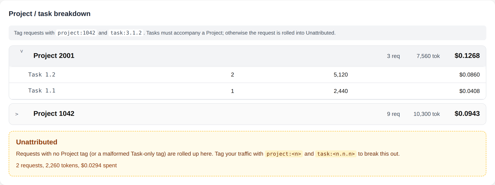

# Usage Dashboard

_Date: 2026-05-07_

The Usage page surfaces a user's LiteLLM accounting data — spend, token
volume, request rate, and budget posture — in a single view. It pulls from
the proxy on demand (no separate database) and aggregates everything
server-side so the browser only renders, never recomputes.


## What it shows

### Budget posture

Pulled from `GET /user/info`. Shows lifetime spend, the configured
`max_budget`, the remaining headroom, and the percentage consumed of the
current budget window. The progress bar shifts colour as the user
crosses the soft budget threshold and again when they cross 90% of the
hard limit.


The reset date is taken from `budget_reset_at` and the window length
from `budget_duration` (e.g. `30d`). When `max_budget` isn't configured
upstream the cards show "Unlimited" rather than implying a 0% bar.

### Token and request totals

Lifetime and current-period totals for tokens (with prompt vs. completion
split), API requests, success vs. failure counts, and tokens-per-request
distribution (avg, p50, p95). The current-period window is controlled by
the **Period** dropdown in the header (7 / 30 / 90 / 365 days).

### Time series

Daily buckets with toggleable metric: spend, tokens, or requests. Empty
days are filled with zeros so a quiet weekend reads as a flat line, not
a missing point. Rendered as inline SVG; no remote chart library is
loaded so the strict CSP stays intact.


### Model breakdown

Per-model rollups: requests, tokens, spend, and a derived effective
**cost per 1K tokens** (spend ÷ tokens). Sorted by spend descending so
the largest line items are at the top.

### API key breakdown

Per-key rollups, joining the spend log's raw `api_key` column to the
key alias from `GET /key/list`. Keys you've deleted still show here if
they have historical spend, so the numbers in this section always
reconcile with the lifetime totals above.

### Project / Task hierarchy

Two-level tree built from `request_tags`. Click a project row to drill
into its constituent tasks.



#### Tag schema

The dashboard expects requests to be tagged using LiteLLM's standard
`metadata.tags` mechanism, with two specific tag forms:

| Form              | Pattern                                  | Example         |
|-------------------|------------------------------------------|-----------------|
| Project           | `project:<integer>`                      | `project:1042`  |
| Task              | `task:<dotted-integer>` (1-3 components) | `task:3.1.2`    |

Both `project:1042` and the human-friendly `Project: 1042` (with
whitespace) are accepted; matching is case-insensitive.

A request with a Task tag but no Project tag is treated as malformed
and rolled into the **Unattributed** bucket — surfacing the gap in
tagging hygiene rather than silently inventing a phantom project named
after the bare task identifier. Requests with no tags at all also land
in Unattributed.

### Request status

Counts per HTTP status code. The dashboard prefers the explicit
`status_code` from `metadata` when present; otherwise it falls back to
the `metadata.status` string, and finally to a heuristic ("recorded
spend or tokens" -> success, otherwise error).

## Data flow

```
Browser ─GET /api/dashboard──> Signup App ┬─GET /user/info──> LiteLLM
                                          ├─GET /spend/logs──>
                                          └─GET /key/list───>
                              <──aggregated JSON─
```

`/spend/logs` is called with `summarize=false` so we get the raw
per-request rows (otherwise LiteLLM aggregates by date and we lose the
per-key, per-model dimensions). All aggregation happens in
`app/core/dashboard_metrics.py` and is unit-tested in
`tests/test_dashboard_metrics.py`.

A failure on `/user/info` or `/key/list` is non-fatal — the dashboard
still renders the spend rollups, just without budget cards or key
aliases. Only a failed `/spend/logs` call surfaces as a 502 to the
caller.

## Period selector

The query parameter `period_days` (default 30, range 1-365) controls
the trailing window used for the "current period" rollups. The
lifetime totals and time-series chart are not affected.

## Endpoints

| Method | Path                              | Description                                  |
|--------|-----------------------------------|----------------------------------------------|
| GET    | `/dashboard`                      | HTML page (auth required)                    |
| GET    | `/api/dashboard?period_days=N`    | Aggregated JSON payload (auth required)      |

## Reproducing the screenshots

```bash
# Start the mock LiteLLM and the app
uv run uvicorn mocks.litellm_mock:app --port 4000 &
DEBUG_MODE=true \
ALLOW_TEST_USER=true \
LITELLM_ADMIN_KEY=sk-mock-admin-key \
FEATURE_PROXY_SECRET_ENABLED=false \
LITELLM_BASE_URL=http://127.0.0.1:4000 \
REQUIRED_KEY_METADATA=project,task_number \
TEST_USER=alice@example.com \
uv run uvicorn app.main:app --port 8765 &

# Seed a few keys so the breakdown table has rows
curl -s -X POST -H "X-User-Email: alice@example.com" \
  -H "Content-Type: application/json" \
  -d '{"name":"alice-prod","duration":"30d","max_budget":100,
       "metadata":{"project":"1042","task_number":"3.1.2"}}' \
  http://127.0.0.1:8765/api/keys

# Capture
uv run python scripts/capture_docs_screenshots.py
```

The mock seeds 14 representative spend rows on first read, including
multiple models, multiple keys, multiple Project/Task tag combinations,
plus one deliberately untagged request and one malformed Task-only
request, so every section of the dashboard renders meaningful data.
